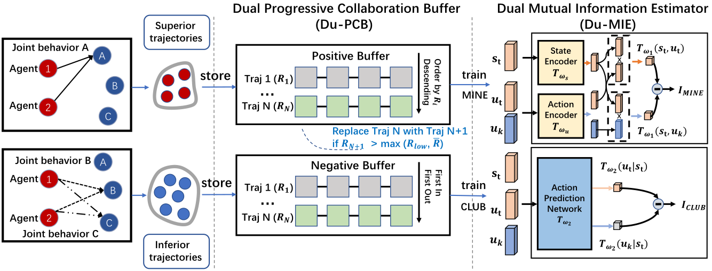

# PMIC: Improving Multi-Agent Reinforcement Learning with Progressive Mutual Information Collaboration
Original PyTorch implementation of PMIC from PMIC: Improving Multi-Agent Reinforcement Learning with Progressive Mutual Information Collaboration


<p align="center">
  <br><br>
  % <a href="https://arxiv.org/abs/2203.04955">[Paper]</a>&emsp;<a href="https://nicklashansen.github.io/td-mpc">[Website]</a>
</p>

## Method

**PMIC** is a MARL framework For more effective MI-driven collaboration.
In PMIC, we use a new collaboration criterion measured by the MI between global states and joint actions.
Based on the criterion, the key idea of PMIC is maximizing the MI associated with superior collaborative behaviors and minimizing the MI associated with inferior ones.
The two MI objectives play complementary roles
by facilitating learning towards better collaborations while avoiding falling into sub-optimal ones.
Specifically, PMIC stores and progressively maintains sets of superior and inferior interaction experiences, from which dual MI neural estimators are established.


# Installation
Known dependencies: Python (3.6.13), OpenAI gym (0.10.5), torch (1.8.1+cu102), numpy (1.19.5), Multi-agent Particle Environment

## Command-line options 
- `--env_name`: defines which environment in the MPE is to be used (default: `"simple"`)
- `--max_adv_c` coefficient of maximizing mutual information (e.q., \alpha in paper)
- `--min_adv_c` coefficient of minimizing mutual information (e.q., \beta in paper)
- `--gpu-no`: gpu num (default: `-1`)
- `--MI_update_freq` update frequency of MINE and CLUB (default: `1`)
- `--max_length` total time steps

## How to run

run the `run.sh` file directly

## Code structure

- `./algorithms/mpe_PMIC_MADDPG.py`: core code for the PMIC-MADDPG algorithm

- `./run_PMIC_MADDPG.py`: code to run the PMIC-MADDPG algorithm

- `./ma_utils.py`: replay buffer and DPCB

- `./logs`: The folder where the logs are stored

- `./tensorboard`: The folder where the tensorboards are stored

- `./output`: The folder where the printed logs are stored

- `./run.sh`: command-line file 


Evaluation videos and model weights can be saved with arguments `save_video=True` and `save_model=True`. Refer to the `cfgs` directory for a full list of options and default hyperparameters, and see `tasks.txt` for a list of supported tasks. We also provide results for all 23 DMControl tasks in the `results` directory.

The training script supports both local logging as well as cloud-based logging with [Weights & Biases](https://wandb.ai). To use W&B, provide a key by setting the environment variable `WANDB_API_KEY=<YOUR_KEY>` and add your W&B project and entity details to `cfgs/default.yaml`.

## Citation

If you use our method or code in your research, please consider citing the paper as follows:

```
@article{xxxxx,
	title={PMIC: Improving Multi-Agent Reinforcement Learning with Progressive Mutual Information Collaboration},
	author={xxxx},
	eprint={2203.04955},
	archivePrefix={arXiv},
	primaryClass={cs.LG},
	year={2022}
}
```


## License & Acknowledgements

PMIC is licensed under the MIT license. [MuJoCo](https://github.com/deepmind/mujoco) and [DeepMind Control Suite](https://github.com/deepmind/dm_control) are licensed under the Apache 2.0 license. We thank the [DrQv2](https://github.com/facebookresearch/drqv2) authors for their implementation of DMControl wrappers.
